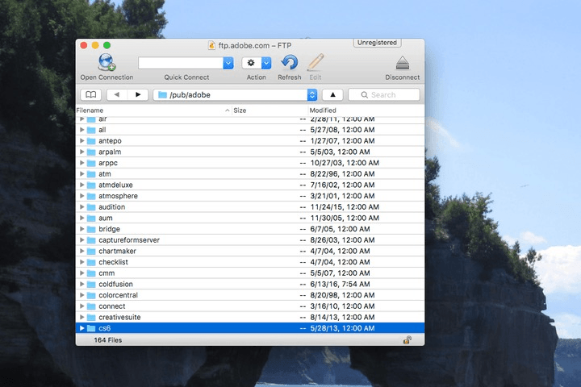

##Basic Linux Commands
ls - directory listing

ls -al - formatted listing hidden files

cd dir - change directory to dir

cd - change to home

pwd - show current directory

mkdir dir - create a directory dir

rm file - delete file

rm -r dir - delete directory dir

rm -f file - force remove file

rm -rf dir - force remove directory dir

cp file1 file2 - copy file1 to file2

cp -r dir1 dir2 - copy dir1 to dir2 (creates dir2 if it doesn't exist)

mv file1 file2 - rename or move file1 to file2 if file2 is an existing directory (moves file1 into directory file2)

ln -s file link - create symbolic link link to file

touch file - create or update file

cat > file - places standard input into file

more file - output the contents of files

head file - output the first 10 lines of file

tail file - output the last 10 lines of file

tail -f file - output the contents of file as it grows, starting with the last 10 lines.

##How to navigate the directory structure
The $ sign means you are logged into your Linux server and at the command prompt.

From this point, you can simply type in the command and press enter.

###This are some basic navigating commands

$ pwd - Use this command to find out where you are in the directory structure. When you log on to Linux, your starting
        directory is always your home directory, so you'll be in /home/[your username] as any other user than root, or
        /root if you're logged in as root. But, this is useful if you lose track.
        
$ cd[directory] - This is used to change the current directory.

$ cd.. - you'll be moved up one directory, so you'll now be in the /home directory.  Repeat the command, and you'll be
         in the root (/) directory.
         
$ cd/etc - This will move the current directory to the /etc directory in one step

$ cd/home/[username] - This moves you back in the directory

$ cd../../ - Also used to move back in the directory

$ cd- - Moves to the previous working directory

$ cd  - Using cd without an argument moves the working directory straight to the user's home directory.

$ ls - This is the list command, so that you can view the contents of a directory including all files and subdirectories

$ ls/home/[username] - In this case, the directory specified has its contents listed.  The directory reference
                       can be absolute or relative.

###Editing a file with Vi

Vi is a powerful text editor included with most Linux systems, even embedded ones. Sometimes you’ll have to edit a text
file on a system that doesn’t include a friendlier text editor, so knowing Vi is essential

#####Command mode
- This is what you’ll see when you open a file in vi. It looks like you can just start typing, but you can’t. Vi is a
 modal text editor, and it opens in command mode. Trying to type at this screen will result in unexpected behavior.
 
 
 
While in command mode, you can move the cursor around with the arrow keys. Press the x key to delete the character
under the cursor. There are a variety of other delete commands — for example, typing dd (press the d key twice) deletes
an entire line of text.
 
 You can select, copy, cut and paste text in command mode. Position the cursor at the left or right side of the text 
 you want to copy and press the v key. Move your cursor to select text, and then press y to copy the selected text or x
 to cut it. Position your cursor at the desired location and press the p key to paste the text you copied or cut.
 
 
 
 #####Insert Mode
 Aside from command mode, the other mode you need to know about is insert mode, which allows you to insert text in Vi. 
 Entering insert mode is easy once you know it exists — just press the i key once after you’ve positioned the cursor in
 command mode. Start typing and Vi will insert the characters you type into the file rather than trying to interpret 
 them as commands.
 
 
 
 #####Saving and Quitting
 You can save and quit vi from command mode. First, ensure you’re in command mode by pressing the escape key (pressing 
 the escape key again does nothing if you’re already in command mode.)
 
 Type :wq and press enter to write the file to disk and quit vi. You can also split this command up — for example, 
 type :w and press enter to write the file to disk without quitting or type :q to quit vi without saving the file.
 
 Vi won’t let you quit if you’ve modified the file since you last saved, but you can type :q! and press enter to ignore
 this warning.
 
  
 
 #Secure Shell/Secure Socket Shell(SSH) 
 SSH is a network protocol that gives users, particularly system administrators, a secure way to access a computer over
 an unsecured network. SSH also refers to the suite of utilities that implement the SSH protocol. Secure Shell provides 
 strong authentication and encrypted data communications between two computers connecting over an open network such as 
 the internet. SSH is widely used by network administrators for managing systems and applications remotely, allowing 
 them to log into another computer over a network, execute commands and move files from one computer to another.
 
 #File Transfer Protocol(FTP)
 FTP is a way to transfer files online.   It’s also one of the oldest protocols in use today, and is a convenient way to
 move files around. An FTP server offers access to a directory, with sub-directories. Users connect to these servers with
 an FTP client, a piece of software that lets you download files from the server, as well as upload files to it.
 
 Unfortunately, FTP is not secure and transfers are not encrypted, so it is relatively easy to intercept files for anyone
 capable of packet sniffing.
 
  
 
 #Secure File Transfer Protocol (SFTP)
 SFTP is a secure way to transfer files between local and remote servers.  It is part of the SSH Protocol.  SFTP was 
 designed by the Internet Engineering Task Force (IETF) as an extended version of SSH 2.0, allowing file transfer over 
 SSH and use with Transport Layer Security (TLS) and VPN applications. Both the commands and data are encrypted in order
  to prevent passwords and other sensitive information from being transferred over the network. The functionality of 
  SFTP is similar to that of FTP. However, SFTP uses SSH to transfer files.
  
  